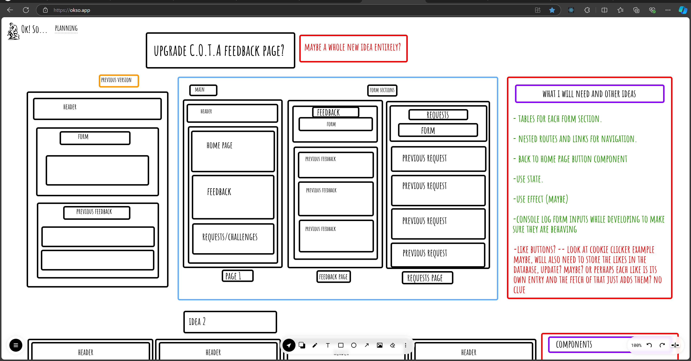

# week-7-assignment

guestbook2.0

# render

client link: https://week-7-assignment-tv3e.onrender.com

server link:

trello link: https://trello.com/invite/b/67092db52b03e4d1a61ed598/ATTI063e36cfc92f8f2d6e6e08cc5d27ca3fB3EC041E/week-7-assignment

# ok so:

# sql:

# database schema:

# Required

- 🎯 What requirements did you achieve?
- 🎯 Were there any requirements or goals that you were unable to achieve?
- 🎯 If so, what was it that you found difficult about these tasks?

# Optional

- 🏹 Feel free to add any other reflections you would like to share about your submission, for example:

- Requesting feedback about a specific part of your submission.
- What useful external sources helped you complete the assignment (e.g YouTube tutorials)?
- What errors or bugs did you encounter while completing your assignment? How did you solve them?
- What went really well and what could have gone better?

## reflection

# requirements achieved

- client was created using react
- express was used to create a server that both has GET and POST endpoints
- a form was built using react for users to create posts/feedback
- i have created multiple pages by using components in react and navigating through them using react router
- a database was set up and seeded with realistic dummy data
- posts were retrieved from the database to the express server using SQL
- posts are rendered and displayed using .map()

# other reflection points

I seemed to have some initial trouble with the rendering of the database data, and later posting the data. It turned out this was simply due to code I had made note of but hadn't yet integrated. Unfortunately, this did eat up a lot of my time trying to fix before realising what the problem was. As a result I decided to keep this guestbook very simple. I had some plans of attempting some of the stretch goals for this project, but after a full day of faffing and little progress as a result of the aforementioned forgetfulness/mistake I decided I'd be better off simplifying things.
